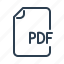

<h2> Welcome to the <b>Secure Rewind and Discard Project </b> Website! You can find three published papers and 
their artifact code here.</h2>

->  <a href="#rewind_discard">Rewind & Discard: Improving Software Resilience using Isolated Domains </a>

-> <a href="#environmental">Exploring the Environmental Benefits of In-Process Isolation for Software Resilience </a>

->  <a href="#sdradffi">Friend or Foe Inside? Exploring In-Process Isolation to Maintain Memory Safety for Unsafe Rust </a>

->  <a href="#morello"> Secure Rewind and Discard on Arm Morello </a>

->  <a href="#thesis"> Shining Light on Critical Gaps in Memory-Safety: From Programming Language to Hardware </a>

---------------------------------------------------------------------------------
<h2><b> Publications </b></h2>  
---------------------------------------------------------------------------------

<h2 id="rewind_discard"> Rewind & Discard: Improving Software Resilience using Isolated Domains (2023)</h2>  
*Merve Gülmez*,
*Thomas Nyman*,
*Christoph Baumann*,
*Jan Tobias Mühlberg*

[DOI:10.1109/DSN58367.2023.00046](http://doi.org/10.1109/DSN58367.2023.00046) (accepted at IEEE DSN'23)

Open Access : 

Extended Version: [arXiv:1905.10242 \[cs.CR\]](https://arxiv.org/pdf/2205.03205.pdf) 

***Abstract***
> Well-known defenses exist to detect and mitigate common faults and memory safety vulnerabilities in software.  Yet, many of these mitigations do not address the
challenge of software _resilience_ and _availability_, i.e., whether a
system can continue to carry out its function and remain responsive, while being under attack and subjected to malicious inputs. We propose _secure rewind and discard of isolated domains_ as an efficient and secure method of improving the resilience of software that is targeted by run-time attacks.  In difference to established approaches, we rely on
compartmentalization instead of replication and checkpointing.  We show the practicability of our methodology by realizing a software library for
Secure Domain Rewind and Discard SDRaD and demonstrate how SDRaD can be applied to real-world software.

<button id="toggleButton" onclick="toggleBibTeX('entry1')">Show BibTeX</button>

<pre>
@inproceedings{Gulmez23a,
  author = {Gülmez, Merve and Nyman, Thomas and Baumann, Christoph and 
            Mühlberg, Jan Tobias},
  title = {Rewind \& Discard: Improving Software Resilience Using Isolated Domains},
  booktitle = {Proceedings of 53rd Annual IEEE/IFIP International Conference on  
               Dependable Systems and Networks},
  series = {DSN '23},
  month = {jun},
  year = {2023},
  pages = {402--416},
  issn = {2158-3927},
  url = {http://doi.org/10.1109/DSN58367.2023.00046}, 
  doi = {10.1109/DSN58367.2023.00046},
  location = {Porto, Portugal},
  publisher = {IEEE Computer Society},
  address = {Washington, DC, USA},
}

@misc{Gulmez22,
  author = {Gülmez, Merve and Nyman, Thomas and Baumann, Christoph and 
            Mühlberg, Jan Tobias},
  title = {Unlimited Lives: Secure In-Process Rollback with Isolated Domains},
  year = {2022},  
  doi = {10.48550/ARXIV.2205.03205},  
  howpublished = {\tt arXiv:2205.03205 [cs.CR]}, 
  url = {https://arxiv.org/abs/2205.03205},
}
</pre>

***Source Code***

Source code for the SDRaD implementation is available at [EricssonResearch /
secure-rewind-and-discard](https://github.com/secure-rewind-and-discard)

<h2 id="environmental">Exploring the Environmental Benefits of In-Process Isolation for Software Resilience(2023)</h2>
*Merve Gülmez*,
*Thomas Nyman*,
*Christoph Baumann*,
*Jan Tobias Mühlberg*

[DOI:10.1109/DSN-S58398.2023.00056](http://doi.org/10.1109/DSN-S58398.2023.00056) (accepted at IEEE DSN'23)

[arXiv:2306.02131 \[cs.CR\]](https://arxiv.org/pdf/2306.02131.pdf)        

***Abstract***

> Memory-related errors remain an important cause
of software vulnerabilities. While mitigation techniques such as
using memory-safe languages are promising solutions, these do
not address software resilience and availability. In this paper,
we propose a solution to build resilience against memory attacks
into software, which contributes to environmental sustainability
and security.

<button id="toggleButton" onclick="toggleBibTeX('entry2')">Show BibTeX</button>

<pre>
@inproceedings{Gulmez23b,
  author = {Gülmez, Merve and Nyman, Thomas and Baumann, Christoph and 
            Mühlberg, Jan Tobias},
  title = {Exploring the Environmental Benefits of In-Process Isolation for 
           Software Resilience},
  booktitle = {Proceedings of 53rd Annual IEEE/IFIP International Conference on 
               Dependable Systems and Networks - Supplemental Volume (DSN-S)},
  series = {DSN '23},
  month = {jun},
  year = {2023},
  pages = {203--205},
  issn = {2833-292X/23},
  url = {http://doi.org/10.1109/DSN-S58398.2023.00056},
  doi = {10.1109/DSN-S58398.2023.00056},
  location = {Porto, Portugal},
  publisher = {IEEE Computer Society},
  address = {Washington, DC, USA},
}
@misc{Gulmez23c,
  author = {Gülmez, Merve and Nyman, Thomas and Baumann, Christoph and 
            Mühlberg, Jan Tobias},
  title = {Exploring the Environmental Benefits of In-Process Isolation for 
           Software Resilience},     
  year = {2023}, doi = {10.48550/ARXIV.2306.02131},
  howpublished = {\tt arXiv:2306.02131 [cs.CR]},
  url = {https://arxiv.org/abs/2306.02131},
}
</pre>

<h2 id="sdradffi"> Friend or Foe Inside? Exploring In-Process Isolation
to Maintain Memory Safety for Unsafe Rust (2023) </h2>
*Merve Gülmez*,
*Thomas Nyman*,
*Christoph Baumann*,
*Jan Tobias Mühlberg*,

[DOI:10.1109/SecDev56634.2023.00020](http://doi.org/10.1109/SecDev56634.2023.00020) (accepted at IEEE SecDev 23) 

FOSDEM Talk : 

Open Access : 

Extended Version: [arXiv:2306.08127 \[cs.CR\]](https://arxiv.org/pdf/2306.08127.pdf)  

***Abstract***

> Rust is a popular memory-safe systems programming
language. In order to interact with hardware or call into non-
Rust libraries, Rust provides unsafe language features that shift
responsibility for ensuring memory safety to the developer. Failing
to do so, may lead to memory safety violations in unsafe code
which can violate safety of the entire application. In this work
we explore in-process isolation with Memory Protection Keys
as a mechanism to shield safe program sections from safety
violations that may happen in unsafe sections. Our approach is
easy to use and comprehensive as it prevents heap and stack-
based violations. We further compare process-based and in-process
isolation mechanisms and the necessary requirements for data
serialization, communication, and context switching. Our results
show that in-process isolation can be effective and efficient, permits
for a high degree of automation, and also enables a notion of
application rewinding where the safe program section may detect
and safely handle violations in unsafe code.

<button id="toggleButton" onclick="toggleBibTeX('entry3')">Show BibTeX</button>

<pre>

@INPROCEEDINGS{Gulmez23d,
  author={Gülmez, Merve and Nyman, Thomas and Baumann, Christoph and Mühlberg, Jan Tobias},
  booktitle={2023 IEEE Secure Development Conference (SecDev)}, 
  title={Friend or Foe Inside? Exploring In-Process Isolation to Maintain Memory Safety for Unsafe Rust}, 
  year={2023},
  volume={},
  number={},
  pages={54-66},
  doi={10.1109/SecDev56634.2023.00020}
}

@misc{Gulmez23c,
  author = {Gülmez, Merve and Nyman, Thomas and Baumann, Christoph and 
            Mühlberg, Jan Tobias},
  title = {Friend or Foe Inside? Exploring In-Process Isolation to 
           Maintain Memory Safety for Unsafe Rust}, 
  year = {2023}, 
  doi = {10.48550/ARXIV.2306.08127},
  howpublished = {\tt arXiv:2306.08127 [cs.CR]},
  url = {https://arxiv.org/abs/2306.08127},
}
</pre>

***Source Code***

Source code for the sdradrustffi implementation is available at [secure-rewind-and-discard](https://github.com/secure-rewind-and-discard)

<h2 id="morello"> Secure Rewind and Discard on Arm Morello </h2>
*Sacha Ruchlejmer*

Open Access : 

***Abstract***

> Memory-unsafe programming languages such as C and C++ are the preferred languages for systems programming, embedded systems, and performance-critical applications. The widespread use of these languages makes the risk of memory-related attacks very high. There are well-known detection mechanisms, but they do not address software resilience.
An earlier approach proposes the Secure Domain Rewind and Discard (SDRaD) of isolated domains as a method to enhance the resilience of software targeted by runtime attacks on x86 architecture, based on hardware-enforced Memory Protection
Key (MPK).
In this work, SDRaD has been adapted to work with the Capability Hardware Enhanced RISC Instructions (CHERI) architecture to be more lightweight and performant.
The results obtained in this thesis show that CHERI-SDRaD, the prototype adaption that leverages the memory-safety properties inherent to the CHERI architecture, results in a solution with less performance degradation (2.2% in Nginx benchmarks) compared to earlier results obtained with the original SDRaD prototype on an Intel-based architecture. The adaption to CHERI additionally allowed limitations inherent to the MPK-based approach to be resolved.

<button id="toggleButton" onclick="toggleBibTeX('entry4')">Show BibTeX</button>

<pre>

@masterthesis{Ruchlejmer24,
  author={Sacha Ruchlejmer},
  title={Secure Rewind and Discard on Arm Morello}, 
  year=2024,
  month= {July},
  school={Phelma, School of engineering in Physics, Applied Physics, Electronics & Materials Science},
  address={Grenoble, France},
  type= {Master's thesis}
}

</pre>

<h2 id="thesis"> Shining Light on Critical Gaps in Memory-Safety: From Programming Language to Hardware</h2>
*Merve Gulmez*

Open Access : 

***Abstract***
> Memory safety refers to a program’s property of ensuring that memory is accessed only
in valid and intended ways. Memory-safety guarantees can be reinforced through
programming languages with built-in safety features, such as garbage collection,
compile- and run-time checks, or through hardware-based solutions like capability
architectures. This thesis focuses on critical gaps in the current state of the art: the
lack of fault tolerance of software-based mitigations for C and C++, limits of the
memory-safety properties in Rust, and initialization-time safety in hardware capability
architectures, such as CHERI.
C and C++ are still the preferred languages for system programming, embedded
systems, and various critical applications due to their performance. However, these
languages lack built-in memory-safety properties. While several well-known defense
techniques can mitigate common faults and memory safety vulnerabilities in software,
many do not address the challenge of software resilience and availability—specifically,
whether a system can continue to function and remain responsive under attack or when
subjected to malicious inputs. As a solution, we propose secure rewind and discard
of isolated domains as an efficient and secure method of improving the resilience
of software that is targeted by run-time attacks. We show the practicability of our
methodology by realizing a software library for Secure Domain Rewind and Discard
(SDRaD) and demonstrate how SDRaD can be applied to real-world software.
Rust has performance characteristics close to traditional system programming
languages such as C and C++ but, unlike these languages, Rust has memory safety
guarantees enforced by compile-time analysis. However, in order to interact with
hardware or call into non-Rust libraries, Rust provides unsafe language features that
shift responsibility for ensuring memory safety to the developer. Failing to do so
may lead to memory-safety violations in Rust code, which can violate the safety of
the entire application. To shield safe program sections from safety violations that
may happen through unsafe language features, we adapt SDRaD to protect Rust code.
To be practical, security features such as SDRaD must be easy for developers to
adopt. We design a Rust-native application programming interface for SDRaD that
leverages Rust’s powerful metaprogramming features to enable easy sandboxing of
unsafe interfaces.
Up to 10% of memory-safety vulnerabilities in languages like C and C++ stem from
uninitialized variables. Capability-based addressing, such as CHERI, mitigates many
memory defects, including spatial and temporal safety violations at an architectural
level. CHERI, however, does not handle undefined behavior from uninitialized
variables. We extend the CHERI capability model to include “conditional capabilities”,
enabling memory-access policies based on prior operations. This allows enforcement
of policies that satisfy memory-safety objectives such as “no reads to memory without
at least one prior write”.
Through these contributions, this thesis furthers the pursuit of comprehensive memory
safety solutions by shining light on previously under-represented challenges: improving
software resilience and availability and preventing uninitialized memory access.
As complementary contributions, this thesis presents an efficient and comprehensive
system call interposition mechanism, and provides compiler-assisted automated
compartmentalization for Rust. In addition, it evaluates different memory-safety-
defense techniques, such as stack canaries and shadow stacks, in terms of their
effectiveness and performance. Orthogonal to these works, it proposes an extension
to CHERI for enforcing data oblivious computation to harden software against timing
side channels. Finally, it discusses environmental sustainability considerations related
to SDRaD.
<button id="toggleButton" onclick="toggleBibTeX('entry5')">Show BibTeX</button>

<pre>

@phdthesis{gulmez2025phd,
title = {Shining Light on Critical Gaps in Memory-Safety: From Programming Language to Hardware},
author = {G{\"u}lmez, Merve and Joosen, Wouter and M{\"u}hlberg, Jan Tobias and Baumann, Christoph},
school = {KU Leuven},
address = {Leuven, Belgium},
year = {2025},
url = {https://lirias.kuleuven.be/4274569&lang=en}
}

</pre>

